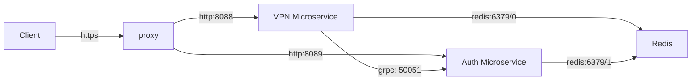
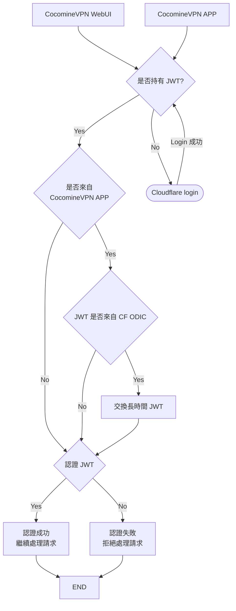

CocomineAPI
===
CocomineAPI 是一個基於 Typescript 語言開發的微服務架構，提供 VPN 服務和用戶認證功能。
該系統由三個主要組件組成：Proxy、VPN Microservice 和 Auth Microservice。
Proxy 負責處理來自客戶端的請求，並將其轉發到相應的微服務。
VPN Microservice 提供 CocomineVPN WebUI 服務，
而 Auth Microservice 負責用戶認證和授權。
此外，系統還使用 Redis 作為緩存和數據存儲，以提高性能和可擴展性。

## 架構



## 認證流程



## 微服務

### VPN Microservice

負責處理所有 VPN 相關功能：

- VPN 伺服器狀態管理（Azure、Google Cloud）
- 用戶訂閱服務（Sing-box 配置）
- VPN 使用追蹤與統計
- WebSocket 即時狀態推送
- Email 和 Discord 通知

詳細文檔：[services/vpn/README.md](services/vpn/README.md)

### Auth Microservice

負責用戶認證和授權：

- Firebase App Check 驗證
- Cloudflare Access OIDC 認證
- JWT Token 產生與驗證
- 提供 gRPC 服務讓其他微服務驗證 token

詳細文檔：[services/auth/README.md](services/auth/README.md)

## 專案結構

```
CocomineVPN-api/
├── api-openapi.yaml          # OpenAPI 規範
├── docker-compose.yml        # Docker Compose 配置
├── nginx.conf                # Nginx 反向代理配置
├── README.md                 # 本文檔
├── protos/                   # 共用 Proto 檔案
│   └── auth.proto
├── services/
│   ├── auth/                 # Auth 微服務
│   │   ├── src/
│   │   ├── config/
│   │   ├── keys/
│   │   └── Dockerfile
│   └── vpn/                  # VPN 微服務
│       ├── src/
│       ├── config/
│       └── Dockerfile
└── __tests__/                # 測試檔案
    └── security/
```

## 快速開始

### 環境需求

- Node.js 22+
- Yarn 4+
- Docker & Docker Compose
- Redis

### 安裝與運行

```bash
# 克隆專案
git clone <repository-url>
cd CocomineVPN-api

# 使用 Docker Compose 啟動所有服務
docker-compose up -d

# 或者分別啟動各個微服務進行開發
cd services/auth && yarn install && yarn start
cd services/vpn && yarn install && yarn start
```

### 配置

1. 複製 `docker-compose.example.yml` 為 `docker-compose.yml`
2. 填寫必要的環境變數（Azure、Google Cloud、Gmail 等憑證）
3. 配置 `services/vpn/config/vm_data.json` 定義 VPN 伺服器
4. 配置 `services/vpn/config/singbox-cert.json` 設定訂閱服務

## 端口配置

| 服務                | 端口    | 說明       |
|-------------------|-------|----------|
| VPN Microservice  | 8088  | HTTP API |
| Auth Microservice | 8089  | HTTP API |
| Auth gRPC         | 50051 | gRPC 服務  |
| Redis             | 6379  | 快取服務     |

## 技術棧

- **語言**: TypeScript
- **運行時**: Node.js
- **Web 框架**: Express.js / WebSocket-Express
- **通信協議**: HTTP/REST、WebSocket、gRPC
- **資料庫**: Redis、MySQL/MariaDB
- **雲端服務**: Azure、Google Cloud
- **認證**: JWT、Cloudflare Access OIDC、Firebase App Check
- **容器化**: Docker

## 授權

ISC License